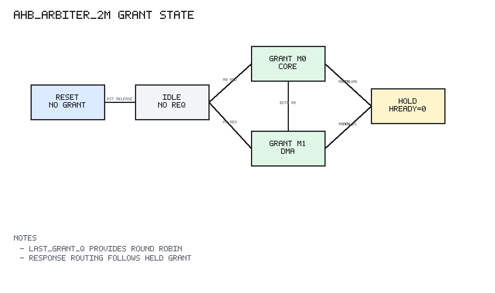

# ahb_arbiter_2m Design Spec

## 1. Scope

`ahb_arbiter_2m` arbitrates between two AHB-Lite masters:

```text
m0 = core
m1 = dma
```

It forwards one selected master's address/control/write-data channel to the
shared AHB fabric and routes the shared response back to the granted master.

## 2. Editable Block Diagram

```text
editable source: bus/docs/diagrams/ahb_arbiter_2m_block.graffle
preview export:  none
detail level:    L2
clock domains:   SEQ clk=hclk_i rst=hresetn_i
```

The diagram separates master inputs, request detection, sequential grant state,
shared address/control muxing, shared response input, response routing, and
master response outputs.

## 3. Ports

| Port group | Direction | Description |
| --- | --- | --- |
| `hclk_i`, `hresetn_i` | input | Arbiter clock and active-low reset |
| `m0_*` inputs | input | Core master address/control/write data |
| `m0_*` outputs | output | Core master read data/ready/response |
| `m1_*` inputs | input | DMA master address/control/write data |
| `m1_*` outputs | output | DMA master read data/ready/response |
| shared AHB outputs | output | Selected address/control/write data |
| shared AHB inputs | input | Response from slave mux |
| `grant_valid_o` | output | Current grant is valid |
| `grant_idx_o` | output | Current granted master, 0 for core, 1 for DMA |

## 4. Behavior

Request detection:

```text
master requests when HTRANS[1] = 1
NONSEQ and SEQ are treated as active requests
IDLE and BUSY are not treated as requests
```

Grant policy:

```text
reset:
  no grant
  last_grant_q = m1, so first simultaneous request grants m0

m0 only:
  grant m0

m1 only:
  grant m1

m0 and m1:
  grant the master that did not win the previous accepted grant
```

Stall policy:

```text
if downstream HREADY is 0:
  hold grant_valid_q and grant_idx_q
  keep selected address/control/write-data source stable
```

Response routing:

```text
current address grant or held response route master receives HRDATA/HREADY/HRESP
non-granted requesting master sees HREADY low
idle non-granted master sees HREADY high
non-granted master HRDATA is zero and HRESP is OKAY
```

## 5. Grant State Diagram



PNG generated by `docs/tools/render_state_pngs.py`.

The arbiter has no named FSM enum, but `grant_valid_q`, `grant_idx_q`,
`last_grant_q`, `route_valid_q`, and `route_idx_q` form the sequential state.

```text
Reset:
  grant_valid_q = 0
  grant_idx_q = 0
  last_grant_q = m1
  route_valid_q = 0
  route_idx_q = 0

When downstream HREADY=0:
  grant_valid_q holds
  grant_idx_q holds
  last_grant_q holds
  route_valid_q holds
  route_idx_q holds
  selected address/control/write-data source holds

When downstream HREADY=1:

  no requests:
    grant_valid_q <- 0
    grant_idx_q holds
    last_grant_q holds
    route_valid_q/route_idx_q hold the most recent accepted address route

  only m0 requests:
    grant_valid_q <- 1
    grant_idx_q <- m0
    last_grant_q <- m0

  only m1 requests:
    grant_valid_q <- 1
    grant_idx_q <- m1
    last_grant_q <- m1

  both request:
    last_grant_q == m1 -> grant m0, last_grant_q <- m0
    last_grant_q == m0 -> grant m1, last_grant_q <- m1
```

Response routing uses the current address grant while `grant_valid_q=1`; once
the address phase goes idle, `route_valid_q/route_idx_q` keep the most recent
accepted route available for registered downstream slave responses.

## 6. Verification Summary

Verified by `tb_ahb_arbiter_2m`.

Coverage includes:

```text
reset no-grant state
m0-only grant
m1-only grant
simultaneous request round-robin alternation
downstream HREADY low grant hold
selected master response routing
non-selected requesting master HREADY low
response ERROR routing
64 deterministic random request patterns with scoreboard
```
