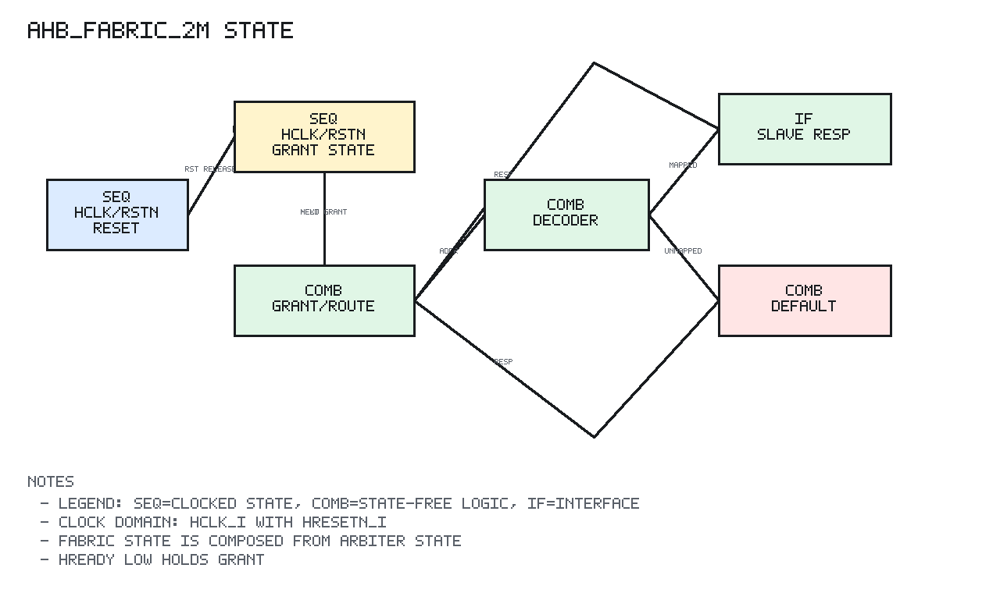

# ahb_fabric_2m Design Spec

## 1. Scope

`ahb_fabric_2m` integrates the initial wasp1 AHB-Lite fabric:

```text
2 masters:
  m0 = core
  m1 = dma

10 external slaves:
  OTP, I-SRAM, D-SRAM, DMA regs, WDG, timer, intc, UART, I2C, GPIO

1 internal default slave:
  unmapped address error response
```

## 2. Editable Block Diagram

```text
editable source: bus/docs/diagrams/ahb_fabric_2m_block.graffle
preview export:  none
detail level:    L2
clock domains:   SEQ clk=hclk_i rst=hresetn_i in ahb_arbiter_2m and data_hsel_q
```

The diagram separates master interfaces, arbiter grant state, address decoder,
external slave interface, default slave, slave response mux, and response route
back to the masters.

## 3. Ports

| Port group | Direction | Description |
| --- | --- | --- |
| `hclk_i`, `hresetn_i` | input | Fabric clock and reset |
| `m0_*` | input/output | Core AHB master side |
| `m1_*` | input/output | DMA AHB master side |
| `slave_hsel_o` | output | One-hot select for 10 external slaves |
| `slave_haddr_o` | output | Shared slave address |
| `slave_htrans_o` | output | Shared slave transfer type |
| `slave_hwrite_o` | output | Shared slave write control |
| `slave_hsize_o` | output | Shared slave transfer size |
| `slave_hburst_o` | output | Shared slave burst type |
| `slave_hprot_o` | output | Shared slave protection bits |
| `slave_hmastlock_o` | output | Shared slave lock bit |
| `slave_hwdata_o` | output | Shared slave write data |
| `slave_hrdata_i` | input | Read data from external slaves |
| `slave_hready_i` | input | Ready from external slaves |
| `slave_hresp_i` | input | Response from external slaves |
| `grant_valid_o` | output | Arbiter grant valid debug/status |
| `grant_idx_o` | output | Arbiter grant index debug/status |
| `default_sel_o` | output | Internal default slave selected |
| `slave_select_err_o` | output | Slave mux multi-select error |

## 4. Behavior

The fabric composes verified submodules:

```text
ahb_arbiter_2m:
  chooses m0 or m1 and serializes one transfer through ADDR/WAIT/RESP

ahb_decoder:
  decodes selected address

ahb_default_slave:
  handles unmapped address errors

ahb_slave_mux:
  returns the registered data-phase selected slave response
```

External slaves see the same shared address/control/write-data bus. Only the
selected slave has its `slave_hsel_o` bit asserted.

The response mux uses `data_hsel_q`, which captures the decoder select during
the emitted address phase and holds it through the arbiter WAIT/RESP phases.
This keeps registered slave read data connected after the address phase has
returned to IDLE.

Unmapped addresses do not assert any external `slave_hsel_o` bit. Instead,
`default_sel_o` is asserted during the address phase. `default_resp_hold_q`
keeps the default ERROR response aligned with the later response phase.

## 5. Fabric State Diagram



PNG generated by `docs/tools/render_state_pngs.py`.

`ahb_fabric_2m` is mostly structural. Its sequential behavior is inherited from
the integrated arbiter FSM plus `data_hsel_q` and `default_resp_hold_q`.

```text
Reset:
  arbiter grant_valid = 0
  external slave_hsel_o = 0
  default_sel_o = 0
  master responses idle/OKAY

Active transfer:
  masters request
        |
        v
  ahb_arbiter_2m grant state chooses held master
        |
        v
  ahb_decoder decodes granted address
        |
        +-- mapped address   -> one external slave_hsel_o bit asserted
        |
        +-- unmapped address -> default_sel_o asserted
        |
        v
  data_hsel_q captures and holds response slave select
  default_resp_hold_q captures default ERROR when unmapped
        |
        v
  ahb_slave_mux returns held slave/default response
        |
        v
  ahb_arbiter_2m routes response to granted master

Downstream HREADY=0 in WAIT/RESP:
  arbiter holds the outstanding owner
  selected slave path remains stable
  non-granted requesting master observes HREADY low
```

The fabric itself has no named top-level FSM, but `data_hsel_q` and
`default_resp_hold_q` are sequential state used to align the data-phase response
mux with registered slaves and the default error path.

## 6. Verification Summary

Verified by `tb_ahb_fabric_2m` with mock slave responses.

Coverage includes:

```text
reset no-grant/no-select state
m0 route to OTP
m1 route to D-SRAM
unmapped default error path
selected external slave HREADY stall propagation
simultaneous m0/m1 request round-robin integration
write-data hold through the fabric wait phase
```

Top-level firmware simulations additionally cover real OTP, D-SRAM, DMA, and
timer integration through this fabric.
