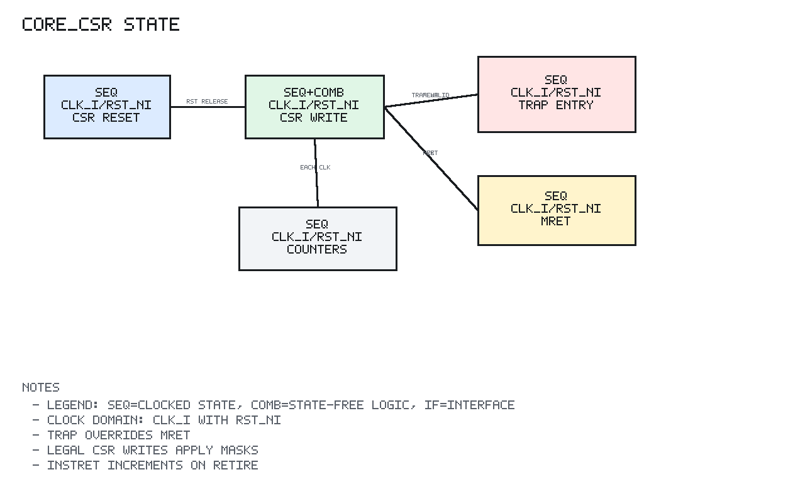

# core_csr Design Spec

## 1. Scope

`core_csr` is a sequential machine-mode CSR file.

## 2. Editable Block Diagram

```text
editable source: core/docs/diagrams/core_csr_block.graffle
preview export:  none
detail level:    L2
clock domains:   SEQ clk=clk_i rst=rst_ni
```

The diagram separates CSR operation inputs, combinational CSR decode/read/mask
logic, update-priority logic, the sequential machine CSR register file,
interrupt pending-image logic, trap/MRET metadata inputs, and CSR outputs.
Legal CSR writes, trap entry, and MRET all converge at the SEQ CSR state block.

## 3. Design

The CSR read path is combinational and returns the current CSR value.

The CSR write path computes the Zicsr write value as:

```text
RW  = csr_wdata_i
RS  = old | csr_wdata_i
RC  = old & ~csr_wdata_i
```

Immediate CSR instructions use the same operation after decode has already
zero-extended the immediate into `csr_wdata_i`.

Writable CSRs are committed on the rising edge. Trap updates take priority
over MRET and occur after normal CSR writes in the same sequential block.

## 4. Masks

`mstatus` stores only MIE, MPIE, and machine-mode MPP.

`mie` stores MTIE and MEIE.

`mtvec` is forced to direct mode by clearing bits `[1:0]`.

`mepc` clears bit zero on CSR write and trap entry.

## 5. Sequential State Diagram



PNG generated by `docs/tools/render_state_pngs.py`.

```text
Reset:
  mstatus_q = MPP=M, MIE=0, MPIE=0
  mie_q/mscratch_q/mepc_q/mcause_q/mtval_q = 0
  mtvec_q = 0
  cycle_q/instret_q = 0

Each clock edge:

  cycle_q <- cycle_q + 1
  if retire_i:
    instret_q <- instret_q + 1

  if legal CSR write:
    selected CSR <- masked Zicsr write data

  if trap_valid_i:
    mstatus.MPIE <- old mstatus.MIE
    mstatus.MIE  <- 0
    mstatus.MPP  <- machine
    mepc_q       <- trap_pc_i with bit0 cleared
    mcause_q     <- {trap_interrupt_i, trap_cause_i}
    mtval_q      <- trap_tval_i

  else if mret_i:
    mstatus.MIE  <- old mstatus.MPIE
    mstatus.MPIE <- 1
    mstatus.MPP  <- machine
```

Priority is intentionally ordered so trap entry overrides MRET when both are
present. Legal CSR writes occur before trap/MRET state updates in the same
sequential block, so trap metadata wins for `mepc`, `mcause`, and `mtval`.

## 6. Target Support

The module uses portable sequential and combinational RTL and does not require
target-specific IC or FPGA primitives.
