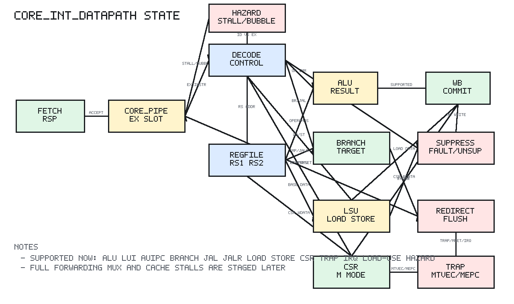

# core_int_datapath Design Spec

## 1. Scope

`core_int_datapath` is a staged integration block. It is not the final core top;
it exists to verify the first executable integer, load/store, CSR, trap, and
interrupt datapath with load-use hazard control before full EX/WB forwarding mux
integration.

## 2. Block Diagram

```text
 frontend rsp
      |
      v
 +-----------+
 | core_pipe |-- ex_pc/ex_instr/ex_valid/fault
 +-----+-----+
       |
       v
 +-------------+      +--------------+
 | core_decode |----->| core_regfile |
 +------+------+      +------+-------+
        |                    ^
        v                    |
 +--------------+      stall/bubble
 | core_hazard  |-------------+
 +------+-------+             |
        |                    v
 +--------------+      rs1/rs2 data
 | wb selector  |             |
 +------+-------+             v
        |              +--------------+      +---------------+
        +------------->| core_alu     |      | core_branch   |
        |              +------+-------+      +-------+-------+
        |                     |                      |
        |                     v                      v
        |              +--------------+       branch redirect
        +------------->| core_lsu     |------------+
        |              +------+-------+            |
        |                     |                    v
        |              dmem req/rsp        +---------------+
        |                     |            | core_trap     |
        |                     v            +-------+-------+
        |              +--------------+            |
        +------------->| core_csr     |<-----------+
        |              +------+-------+     trap state/irq
        |                     |
        |                     v
        |              +--------------+
        +------------->| core_wb      |
                       +------+-------+
                              |
                              v
                         regfile write
                         commit observe
```

## 3. Datapath

`core_pipe` supplies the execute/writeback slot. This milestone decodes the EX
slot directly and reads the register file using the decoded source fields.

ALU operand selection:

```text
AUIPC lhs = ex_pc
normal lhs = rs1_data
immediate rhs = dec_imm
register rhs = rs2_data
```

Writeback source selection:

```text
LUI       -> CORE_WB_IMM
JAL/JALR  -> CORE_WB_PC4
load      -> CORE_WB_LOAD
CSR       -> CORE_WB_CSR
AUIPC     -> ALU result ex_pc + imm
ALU ops   -> ALU result
```

Unsupported classes and faults drive the `core_wb` fault input so register
writeback is suppressed.

Control-flow selection:

```text
taken branch -> redirect to ex_pc + B immediate
JAL          -> redirect to ex_pc + J immediate and write rd = ex_pc + 4
JALR         -> redirect to (rs1 + I immediate) with bit 0 cleared and write rd = ex_pc + 4
not-taken    -> no redirect and no register writeback
```

Redirect is gated by `ex_valid`, fetch fault, and illegal decode status. When a
redirect is asserted, `core_pipe` flushes younger IF/ID and EX/WB state on the
next active clock edge and reloads the fetch PC with the branch target.

Load/store selection:

```text
effective address = rs1_data + decoded immediate
load              -> issue read request and write formatted load data to rd
store             -> issue write request with lane-shifted data and byte strobes
misaligned access -> no data request, no register writeback, lsu_fault_o=1
response error    -> request is observable, no register writeback, lsu_fault_o=1
```

The staged data-memory interface is single-cycle and response-data based. It is
intended as the integration boundary for the later D-cache/AHB path, where
stall and response handshake state will be added.

CSR/trap selection:

```text
CSR instruction -> old CSR value writes rd, CSR state updates on clock edge
illegal CSR     -> illegal-instruction trap, no rd writeback
ECALL/EBREAK    -> trap to mtvec, mepc captures faulting PC
MRET            -> redirect to mepc, mstatus.MIE restored from MPIE
enabled IRQ     -> interrupt trap to mtvec with interrupt mcause bit set
```

Trap/MRET redirects have priority over branch/JAL/JALR redirects. Trap entry
updates `mepc`, `mcause`, `mtval`, and `mstatus` in `core_csr` on the same clock
edge that `core_pipe` flushes younger slots.

Hazard selection:

```text
ID uses rs1/rs2 matching EX load rd -> stall fetch/decode and bubble execute
EX forwarding indication            -> exposed for later operand mux integration
WB forwarding indication            -> exposed for later operand mux integration
```

The current staged datapath still relies on register-file timing for non-load
adjacent dependencies. The forwarding decision outputs are observable now, and
the actual operand forwarding muxes will be added when the final EX/WB split is
introduced.

## 4. Sequential State Diagram



PNG generated by `docs/tools/render_state_pngs.py`.

The sequential state comes from the instantiated `core_pipe` and
`core_regfile`:

```text
Reset:
  core_pipe fetch PC <- boot_pc_i
  core_pipe IF/ID and EX/WB slots invalid
  core_regfile x1..x31 <- 0

Each accepted fetch response:
  core_pipe captures instruction into IF/ID
  old IF/ID advances to EX/WB

Each execute/writeback cycle:
  EX instruction is decoded
  register operands are read
  ALU/writeback data is computed
  branch/JAL/JALR target is computed
  load/store request and load writeback data are computed
  CSR read/write data and trap priority are computed
  ID source registers are compared with EX/WB destinations
  if load-use hazard:
    core_pipe holds fetch/decode and injects an EX bubble
  if load/store fault:
    architectural writeback is suppressed
  if trap or MRET redirects:
    core_pipe blocks response acceptance for the redirect cycle
    core_pipe flushes younger slots and loads mtvec/mepc target PC
  if branch/JAL/JALR redirects:
    core_pipe blocks response acceptance for the redirect cycle
    core_pipe flushes younger slots and loads target PC
  if valid and supported and rd!=x0:
    core_regfile writes rd on the next clock edge
```

The integrated regfile instance disables same-cycle bypass to avoid a
writeback/read combinational loop through the integrated datapath. Adjacent
integer dependencies are still verified against the staged pipeline timing.

## 5. Target Support

The module is target-neutral synthesizable RTL and uses no IC or Virtex-7
specific primitive.
