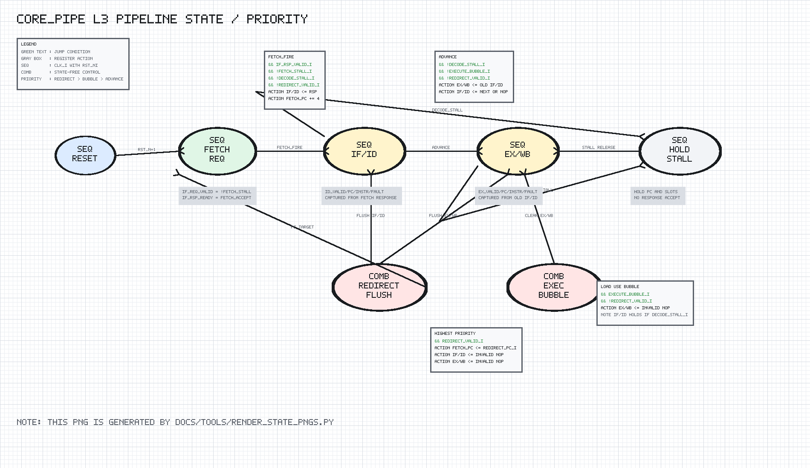

# core_pipe Design Spec

## 1. Scope

`core_pipe` is the initial pipeline-control integration skeleton for the
planned simple in-order core. This milestone intentionally does not execute
instruction semantics; it establishes the pipeline state machinery that later
connects decode, regfile, ALU, LSU, CSR, trap, hazard, and writeback logic.

## 2. Block Diagram

```text
Legend: IF=interface, COMB=combinational logic, SEQ=clocked state
SEQ clock/reset domain: clk=clk_i, rst=rst_ni

                     redirect_valid/pc
                            |
                            v
 boot_pc ---> SEQ fetch PC register ---> frontend request PC
                            |
             frontend response valid/ready
                            |
                            v
                    +---------------+
                    | SEQ IF/ID slot|
                    | pc/instr/flt  |
                    +-------+-------+
                            |
                 decode_stall / bubble controls
                            |
                            v
                    +---------------+
                    | EX/WB slot    |
                    | pc/instr/flt  |
                    +---------------+
```

## 3. Design

The fetch PC is initialized from `boot_pc_i`. A normal accepted frontend
response increments the fetch PC by four. A redirect overwrites the fetch PC
with `redirect_pc_i`.

The frontend response is accepted when:

```text
!fetch_stall_i && !decode_stall_i && !redirect_valid_i
```

Redirect has highest priority and clears both pipeline slots.

If `execute_bubble_i` is asserted, the EX/WB slot is cleared. Otherwise, when
decode is not stalled, IF/ID advances into EX/WB.

IF/ID captures a fetch response in the same cycle it advances. If no response
is accepted and decode is not stalled, IF/ID is cleared.

## 4. Pipeline State Diagram



PNG generated by `docs/tools/render_state_pngs.py`.

```text
Reset:
  fetch_pc_q = boot_pc_i
  IF/ID.valid = 0, IF/ID.pc = 0, IF/ID.instr = NOP, IF/ID.fault = 0
  EX/WB.valid = 0, EX/WB.pc = 0, EX/WB.instr = NOP, EX/WB.fault = 0

Clock-edge priority:

  redirect_valid_i
        |
        v
  fetch_pc_q = redirect_pc_i
  IF/ID <- invalid NOP
  EX/WB <- invalid NOP

  else normal pipeline update:

    fetch_fire = if_rsp_valid_i &&
                 !fetch_stall_i &&
                 !decode_stall_i &&
                 !redirect_valid_i

    if fetch_fire:
      fetch_pc_q <- fetch_pc_q + 4

    if execute_bubble_i:
      EX/WB <- invalid NOP
    else if !decode_stall_i:
      EX/WB <- old IF/ID
    else:
      EX/WB holds old value

    if fetch_fire:
      IF/ID <- {valid=1, pc=old fetch_pc_q, instr=if_rsp_instr_i,
                fault=if_rsp_fault_i}
    else if !decode_stall_i:
      IF/ID <- invalid NOP
    else:
      IF/ID holds old value
```

`redirect_valid_i` therefore beats fetch acceptance, decode advance, and
execute bubble. A load-use sequence is represented by asserting
`decode_stall_i` and `execute_bubble_i` together: IF/ID holds while EX/WB is
cleared.

## 5. Target Support

The module is target-neutral synthesizable sequential logic. No IC or
Virtex-7-specific primitive is required.
