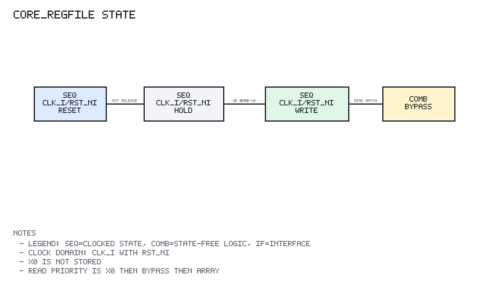

# core_regfile Design Spec

## 1. Scope

`core_regfile` is the integer register storage submodule for the RV32I core.

## 2. Block Diagram

```text
                  +----------------------+
 clk_i ---------->|                      |
 rst_ni --------->|  regs_q x1..x31      |
 we_i ----------->|  rising-edge write   |
 waddr_i -------->|                      |
 wdata_i -------->|                      |
                  +-----+----------+-----+
                        |          |
                        v          v
 raddr1_i --->+----------------+ +----------------+<--- raddr2_i
              | x0/bypass/read | | x0/bypass/read |
 waddr_i ---->| mux            | | mux            |<--- waddr_i
 wdata_i ---->|                | |                |<--- wdata_i
 we_i ------->+-------+--------+ +--------+-------+<--- we_i
                      |                   |
                      v                   v
                   rdata1_o            rdata2_o
```

## 3. Design

The storage array contains only registers `x1` through `x31`; `x0` is not
physically stored.

The write path ignores writes when `waddr_i` is zero. For nonzero write
addresses, `wdata_i` is committed to `regs_q[waddr_i]` on the rising clock
edge.

`BYPASS_EN` controls same-cycle write-to-read bypass. It defaults to enabled
for standalone regfile behavior. Integration blocks may disable it when the
write data is generated from the same read path and would otherwise create a
combinational loop.

Each read port uses a combinational priority:

```text
1. address zero returns 0
2. matching active write to a nonzero address returns wdata_i
3. otherwise return regs_q[address]
```

## 4. Register State Diagram



PNG generated by `docs/tools/render_state_pngs.py`.

```text
Reset:
  for x1..x31:
    regs_q[x] <- 0
  x0 is not stored and always reads as zero

Each clock edge after reset:

  if we_i && waddr_i != 0:
    regs_q[waddr_i] <- wdata_i
  else:
    regs_q holds

Combinational read priority:
  raddr == 0                    -> 0
  BYPASS_EN && we_i && waddr_i == raddr -> wdata_i same-cycle bypass
  otherwise                     -> regs_q[raddr]
```

There is no explicit FSM. The only sequential state is the `x1..x31` register
array.

## 5. Target Support

The register file uses synthesizable flip-flop array RTL. It is portable across
IC and Xilinx Virtex-7 FPGA targets. No target primitive is required.
