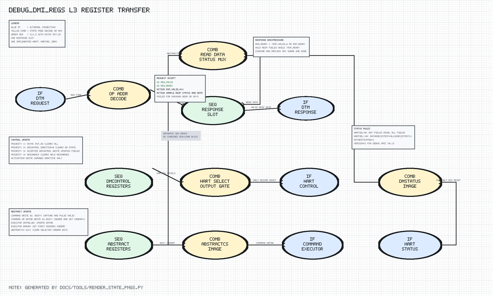

# debug_dmi_regs Design Spec

## 1. Scope

`debug_dmi_regs` is the first independently verified Debug Module leaf. It does
not include the JTAG TAP, DTM scan registers, abstract command executor, or core
Debug Mode implementation.

## 2. Detailed Block Diagram



The PNG is generated by `docs/tools/render_state_pngs.py`. Timing-class colors
follow the project policy: blue is `IF`, yellow is `COMB`, and green is `SEQ`.

```text
Clock/reset domain for every SEQ block: clk=clk_i, rst=rst_ni

 IF DTM request
      |
      v
 COMB operation/address decode -----> COMB read-data/status mux
      |                                      |
      +----------------+---------------------+
                       v
              SEQ response slot ------------> IF DTM response

 Accepted writes fan out to separate state blocks:

 COMB write decode ---> SEQ dmcontrol state ---> COMB hart request gating ---> IF hart
                  \---> SEQ abstract state  ---> IF abstract executor

 IF hart status ------> COMB dmstatus image ----> COMB read-data/status mux
 IF executor status --> COMB abstractcs image --> COMB read-data/status mux
```

No block combines sequential and combinational timing classes.

## 3. Response Slot

`rsp_valid_q`, `rsp_resp_q`, and `rsp_data_q` form a one-entry response buffer.

```text
req_ready = !rsp_valid_q || rsp_ready

Reset:
  rsp_valid_q = 0
  rsp_resp_q  = SUCCESS
  rsp_data_q  = 0

On request handshake:
  rsp_valid_q = 1
  rsp_resp_q  = SUCCESS or FAILED from current decode
  rsp_data_q  = read mux data for READ, otherwise zero

On response handshake without replacement request:
  rsp_valid_q = 0

While rsp_valid_q && !rsp_ready:
  response state holds and req_ready is zero
```

## 4. Control State

`dmactive_q`, `ndmreset_q`, `haltreq_q`, `resumereq_q`, and `hartsel_q` are
separate registers. Output gating is combinational:

```text
selected_hart_exists = (hartsel_q == 0)
haltreq_o   = dmactive_q && selected_hart_exists && haltreq_q
resumereq_o = dmactive_q && selected_hart_exists && resumereq_q
ndmreset_o  = dmactive_q && ndmreset_q
```

Runtime update priority is:

```text
1. asynchronous rst_ni clear
2. accepted dmcontrol write with dmactive=0 clears DM state
3. accepted active dmcontrol write updates level controls and hartsel
4. hart_resumeack_i clears resumereq when no same-edge write sets it
5. otherwise hold
```

Activation from inactive state changes only `dmactive_q`. This makes debugger
initialization deterministic. Within an active write, `haltreq=1` clears and
overrides `resumereq`; otherwise a written resume request is held until ack.

## 5. Abstract State

`command_q`, `data0_q`, and `cmderr_q` implement the stage-1 abstract register
state. `abstract_busy_i` remains owned by the later command executor.

```text
command write && !busy && dmactive:
  command_q       <- DMI write data
  command_valid_o <- 1 for one cycle

command/data0 write && busy:
  payload ignored
  cmderr_q <- BUSY only when cmderr_q was NONE

executor completion:
  data0_we_i            -> data0_q <- data0_wdata_i
  command_error_valid_i -> set first nonzero cmderr

abstractcs write:
  cmderr_q <- cmderr_q & ~write_data[10:8]
```

## 6. Read Images

`dmcontrol`, `dmstatus`, and `abstractcs` are built in independent combinational
blocks. A final read mux selects one image from the current request address.
The DMI response slot samples that image on the request handshake edge.

## 7. No Explicit FSM

There is no encoded FSM. The sequential behavior is represented by the
response-valid slot and independent control/abstract register banks. The L3
PNG therefore shows detailed register-transfer conditions, reset paths, output
gating, and update priority instead of inventing artificial states.

## 8. Target Selection

The module includes `wasp1_target_defs.svh` and uses target-neutral standard-cell
style logic. Target macros do not alter DMI addresses, register fields, status,
or handshake behavior.
