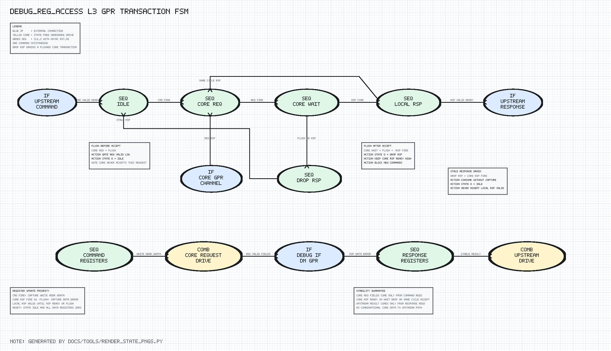

# debug_reg_access Design Spec

## 1. Scope

`debug_reg_access` is a low-level transport sequencer. `debug_abstract_cmd`
will later validate command type, register number, size, transfer, write, and
post-execution fields before issuing this module's compact command.

## 2. Detailed FSM Diagram



The L3 PNG is generated by `docs/tools/render_state_pngs.py`. Every green `SEQ`
block uses `clk_i/rst_ni`; yellow `COMB` blocks contain no state.

## 3. FSM

| State | Function |
| --- | --- |
| `IDLE` | Accept one upstream command |
| `CORE_REQ` | Hold captured request until core ready |
| `CORE_WAIT` | Wait for the accepted request's response |
| `LOCAL_RSP` | Hold captured result until upstream ready |
| `DROP_RSP` | Drain a stale core response after flush |

Normal transitions:

```text
IDLE --cmd_valid && cmd_ready--> CORE_REQ
CORE_REQ --core_req_valid && core_req_ready--> CORE_WAIT
CORE_WAIT --core_rsp_valid && core_rsp_ready--> LOCAL_RSP
LOCAL_RSP --rsp_valid && rsp_ready--> IDLE
```

If a core response is valid on the request-accept edge, `CORE_REQ` transitions
directly to `LOCAL_RSP` and captures the result.

## 4. Flush Transitions

```text
IDLE + flush                 -> remain IDLE, cmd_ready=0
CORE_REQ + flush             -> IDLE; request valid is gated off
CORE_WAIT + flush + response -> IDLE; consume and discard response
CORE_WAIT + flush            -> DROP_RSP
LOCAL_RSP + flush            -> IDLE; discard local response
DROP_RSP + core response     -> IDLE; consume stale response
```

`DROP_RSP` is not an error state. It is an ownership barrier that preserves
one-command/one-response pairing after cancellation.

## 5. Datapath Registers

The command register bank stores write direction, five-bit address, and write
data on `cmd_fire`. The response register bank stores read data and error only
on a non-flushed core response handshake.

Core request fields are driven solely from the command registers. Upstream
response fields are driven solely from the response registers, so both
channels remain stable under backpressure.

## 6. Interface Partition

The module uses `debug_if.dm_gpr`, which exposes only GPR signals. It cannot
drive halt, resume, or step signals owned by other Debug Module subblocks.

## 7. Target Behavior

The RTL is target-neutral and includes `wasp1_target_defs.svh`. Target macros do
not alter handshake timing or command/response semantics.
