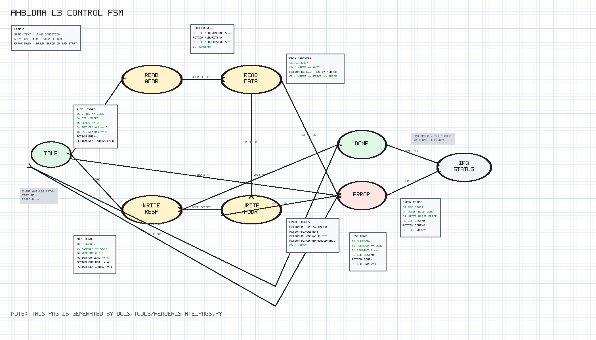
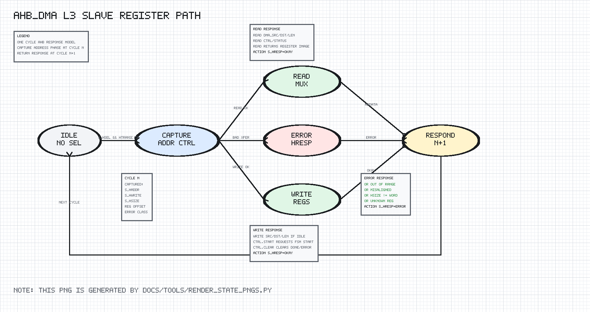

# ahb_dma Design Spec

## 1. Scope

`ahb_dma` is the first single-channel DMA block for wasp1.

It exposes an AHB-Lite slave register interface for software configuration and
an AHB-Lite master interface for memory-to-memory word copies.

## 2. Editable Block Diagram

```text
editable source: dma/docs/diagrams/ahb_dma_block.graffle
preview export:  none
detail level:    L3
clock domains:   SEQ clk=hclk_i rst=hresetn_i
```

The diagram separates the AHB slave register path, DMA control FSM, AHB master
drive logic, read-data latch, sticky status registers, interrupt output logic,
and both AHB interfaces. The control FSM and status registers are separate SEQ
blocks so their update priorities are not hidden inside the master datapath.

## 3. Register Map

Offsets are relative to `DMA_BASE`.

| Offset | Register | Access | Description |
| --- | --- | --- | --- |
| `0x00` | `DMA_SRC` | R/W | Source byte address |
| `0x04` | `DMA_DST` | R/W | Destination byte address |
| `0x08` | `DMA_LEN` | R/W | Transfer length in 32-bit words |
| `0x0C` | `DMA_CTRL` | R/W | bit0 start, bit1 irq_enable, bit2 clear done/error |
| `0x10` | `DMA_STATUS` | R | bit0 busy, bit1 done, bit2 error |

## 4. Behavior

The first DMA implementation supports one single-channel copy mode:

```text
word-sized memory-to-memory copy
one AHB read followed by one AHB write per word
no burst
no unaligned transfer
no cache coherence management
```

Start is accepted when:

```text
DMA is idle
LEN is nonzero
SRC and DST are word aligned
```

On successful completion:

```text
STATUS.done = 1
STATUS.error = 0
```

On rejected start or AHB master error:

```text
STATUS.done = 0
STATUS.error = 1
```

`DMA_CTRL.clear` clears sticky `done` and `error`. `dma_irq_o` is asserted when
`irq_enable` is set and either `done` or `error` is sticky.

## 5. AHB-Lite Behavior

Slave register interface:

```text
cycle N:
  capture selected NONSEQ/SEQ address/control

cycle N+1:
  return registered read data or write response
```

Only aligned word register accesses are supported.

Master interface:

```text
read address phase
read response phase
write address phase
write response phase
repeat until LEN words complete
```

The master uses `HTRANS=NONSEQ`, `HSIZE=word`, and `HBURST=single`.

Error response:

```text
register out-of-range transfer -> ERROR
misaligned register transfer   -> ERROR
non-word register transfer     -> ERROR
unknown register access        -> ERROR
AHB master read/write HRESP    -> STATUS.error
```

## 6. DMA Control FSM



PNG generated by `docs/tools/render_state_pngs.py`.

```text
Reset:
  DMA_IDLE
  SRC/DST/LEN = 0
  busy/done/error = 0
  master outputs idle

DMA_IDLE:
  busy = 0
  start accepted when LEN != 0 and SRC/DST word aligned
        |
        v
  DMA_READ_ADDR

  rejected start -> DMA_IDLE, error=1, done=0

DMA_READ_ADDR:
  drive AHB master read address for current SRC
  HREADY -> DMA_READ_WAIT

DMA_READ_WAIT:
  absorb one registered fabric/SRAM response latency slot
  HRESP=ERROR is remembered for DMA_READ_DATA
  HREADY -> DMA_READ_DATA

DMA_READ_DATA:
  wait for read response
  remembered HRESP=ERROR or current HRESP=ERROR -> DMA_IDLE, busy=0, error=1
  no error -> latch read data, DMA_WRITE_ADDR

DMA_WRITE_ADDR:
  drive AHB master write address/current DST and latched data
  HREADY -> DMA_WRITE_RESP

DMA_WRITE_RESP:
  wait for write response
  HRESP=ERROR -> DMA_IDLE, busy=0, error=1
  HRESP=OKAY and more words:
    SRC <- SRC + 4
    DST <- DST + 4
    remaining <- remaining - 1
    -> DMA_READ_ADDR
  HRESP=OKAY and last word:
    busy=0, done=1, error=0
    -> DMA_IDLE
```

The slave register path is a separate one-cycle AHB response state machine:



PNG generated by `docs/tools/render_state_pngs.py`.

```text
cycle N capture selected register transfer
cycle N+1 return read/write response or ERROR
```

`DMA_CTRL.clear` clears sticky `done/error` in IDLE or while not conflicting
with terminal transfer completion.

## 7. Implementation Targets

`ahb_dma` is target-neutral synthesizable logic. It includes
`common/rtl/wasp1_target_defs.svh` and is linted for:

```text
generic simulation
WASP1_TARGET_IC
WASP1_TARGET_FPGA_XILINX_VIRTEX7
```

No target-specific memory macro or FPGA primitive is required.

## 8. Verification Summary

Verified by `tb_ahb_dma`.

Coverage includes:

```text
reset output state
register read/write paths
successful 4-word copy
4 deterministic random copy cases
done IRQ
zero-length start error
misaligned source error
master read error
master write error
misaligned, unsupported size, and unknown register errors
generic, IC, and Virtex-7 target lint
```
