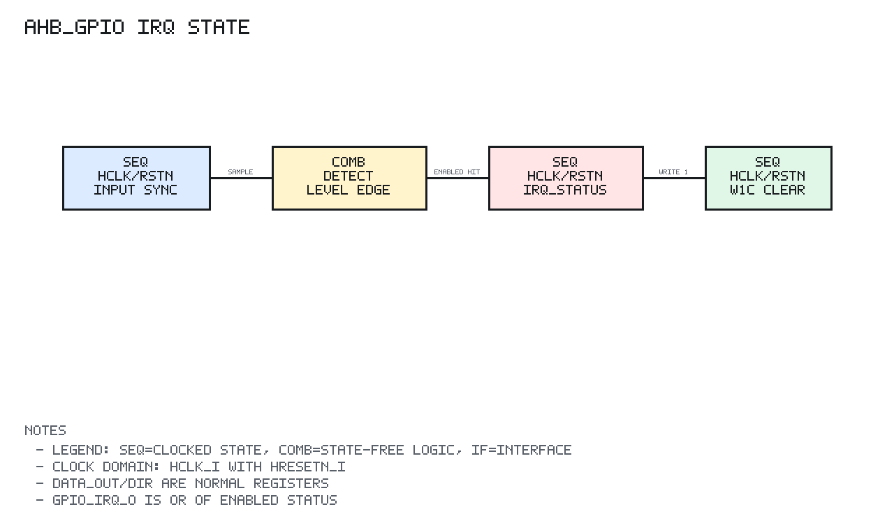

# ahb_gpio Design Spec

## 1. Scope

`ahb_gpio` is the 32-bit GPIO peripheral for wasp1.

It provides synchronized input sampling, software-controlled output value,
output enable direction control, atomic set/clear/toggle helpers, and per-bit
interrupt generation.

## 2. Block Diagram

```text
Legend: IF=interface, COMB=combinational logic, SEQ=clocked state
SEQ clock/reset domain: clk=hclk_i, rst=hresetn_i

              hclk_i / hresetn_i
                      |
                      v
 hsel_i ----------+----------------+
 haddr_i -------->| SEQ addr phase |
 htrans_i ------->| range/alignment|
 hwrite_i ------->| word-only check|
 hsize_i -------->| capture regs   |
                 +--------+-------+
                          |
                          v
                 +----------------+
 hwdata_i ------>| SEQ reg write  |
                 | OUT DIR IRQCFG |
                 +--------+-------+
                          |
       +------------------+-------------------+
       |                                      |
       v                                      v
 +------------+                      +----------------+
 | OUT / DIR  |---- gpio_out_o       | input sync     |<--- gpio_in_i
 | registers  |---- gpio_oe_o        | 2-stage sample |
 +------------+                      +--------+-------+
                                             |
                                             v
                                    +----------------+
                                    | irq detect     |
                                    | level / edge   |
                                    | polarity / W1C |
                                    +--------+-------+
                                             |
                                             v
                                      gpio_irq_o

                 +----------------+
                 | read mux       |
                 | HRDATA/HRESP   |
                 +--------+-------+
                          |
                  hrdata_o/hresp_o
                  hready_o always 1
```

## 3. Register Map

Offsets are relative to `GPIO_BASE`.

| Offset | Register | Access | Description |
| --- | --- | --- | --- |
| `0x00` | `GPIO_DATA_IN` | R | Synchronized input value |
| `0x04` | `GPIO_DATA_OUT` | R/W | Output value |
| `0x08` | `GPIO_DIR` | R/W | Output enable, 1 means output |
| `0x0C` | `GPIO_SET` | W | Set output bits |
| `0x10` | `GPIO_CLR` | W | Clear output bits |
| `0x14` | `GPIO_TOGGLE` | W | Toggle output bits |
| `0x18` | `GPIO_IRQ_EN` | R/W | Per-bit interrupt enable |
| `0x1C` | `GPIO_IRQ_TYPE` | R/W | 0 level, 1 edge |
| `0x20` | `GPIO_IRQ_POL` | R/W | Level: 1 high, 0 low. Edge: 1 rising, 0 falling |
| `0x24` | `GPIO_IRQ_STATUS` | R/W1C | Latched interrupt status |

## 4. Behavior

Inputs pass through a two-stage synchronizer before software reads them or the
interrupt detector uses them.

Output behavior:

```text
GPIO_DATA_OUT write -> replaces output value
GPIO_SET write      -> out = out | wdata
GPIO_CLR write      -> out = out & ~wdata
GPIO_TOGGLE write   -> out = out ^ wdata
GPIO_DIR write      -> controls gpio_oe_o
```

Interrupt behavior:

```text
IRQ_TYPE = 0, IRQ_POL = 1 -> level high
IRQ_TYPE = 0, IRQ_POL = 0 -> level low
IRQ_TYPE = 1, IRQ_POL = 1 -> rising edge
IRQ_TYPE = 1, IRQ_POL = 0 -> falling edge
```

Only enabled interrupt bits can set `GPIO_IRQ_STATUS`. `GPIO_IRQ_STATUS` is
cleared by writing ones to the bits to clear. `gpio_irq_o` is the OR of enabled
latched status bits.

## 5. AHB-Lite Behavior

`ahb_gpio` implements a one-cycle response model:

```text
cycle N:
  capture selected NONSEQ/SEQ address/control

cycle N+1:
  return registered read data or write response
```

Only aligned word accesses are supported.

Error response:

```text
out-of-range selected transfer -> ERROR
misaligned selected transfer   -> ERROR
non-word transfer              -> ERROR
unknown register access        -> ERROR
write to read-only DATA_IN     -> ERROR
```

`HREADY` is always high.

## 6. Sequential State Diagram



PNG generated by `docs/tools/render_state_pngs.py`.

```text
Reset:
  DATA_OUT/DIR/IRQ_EN/IRQ_TYPE/IRQ_POL/IRQ_STATUS = 0
  input synchronizer stages = 0
  response registers = OKAY/0

Each hclk_i edge:

  Input synchronizer:
    gpio_in_meta_q <- gpio_in_i
    gpio_in_sync_q <- gpio_in_meta_q

  AHB capture:
    selected transfer -> capture address/control/error class
    unselected        -> capture idle response

  Register write response:
    DATA_OUT write      -> out_q <- hwdata_i
    DIR write           -> dir_q <- hwdata_i
    SET write           -> out_q <- out_q | hwdata_i
    CLR write           -> out_q <- out_q & ~hwdata_i
    TOGGLE write        -> out_q <- out_q ^ hwdata_i
    IRQ config writes   -> update IRQ_EN/TYPE/POL
    IRQ_STATUS W1C      -> clear written status bits

  IRQ detect:
    level/edge condition && IRQ_EN -> set IRQ_STATUS bit

  Read/response:
    hrdata_o <- selected register read data
    hresp_o  <- OKAY or ERROR from captured transfer
```

Interrupt set and W1C clear priority must remain deterministic when both touch
the same bit in one cycle; the RTL behavior is verified by the GPIO testbench.

## 7. Implementation Targets

`ahb_gpio` is target-neutral synthesizable logic. It includes
`common/rtl/wasp1_target_defs.svh` and is linted for:

```text
generic simulation
WASP1_TARGET_IC
WASP1_TARGET_FPGA_XILINX_VIRTEX7
```

Top-level pad or FPGA IO primitive binding is intentionally outside this module.

## 8. Verification Summary

Verified by `tb_ahb_gpio`.

Coverage includes:

```text
reset output state
output write/readback
direction write/readback
set/clear/toggle helpers
input synchronization reads
level high interrupt and W1C behavior
rising and falling edge interrupts
IRQ masking
misaligned, unsupported size, unknown register, and out-of-range errors
deterministic random output toggles
generic, IC, and Virtex-7 target lint
```
