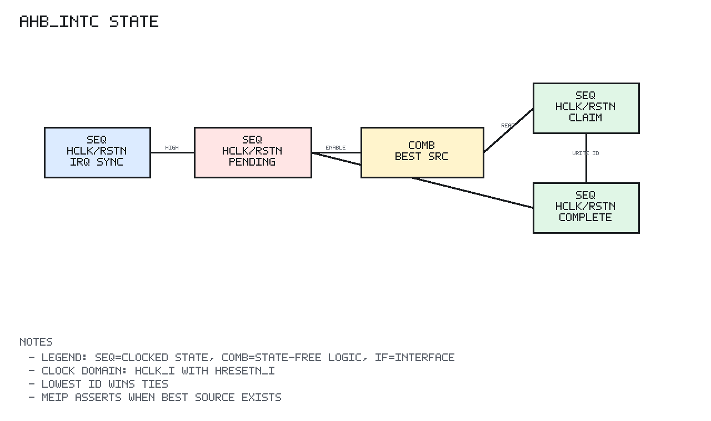

# ahb_intc Design Spec

## 1. Scope

`ahb_intc` is a PLIC-lite AHB-Lite interrupt controller for wasp1.

## 2. Block Diagram

```text
Legend: IF=interface, COMB=combinational logic, SEQ=clocked state
SEQ clock/reset domain: clk=hclk_i, rst=hresetn_i

              hclk_i / hresetn_i
                      |
                      v
 irq_src_i ----> +-------------+
                 | SEQ 2-stage |
                 +------+------+
                        |
                        v
                 +-------------+
                 | SEQ pending_q|<--- W1C / complete
                 +------+------+
                        |
     +------------------+-------------------+
     |                                      |
     v                                      v
 +-------------+                     +-------------+
 | SEQ enable_q|                     | SEQ priority|
 +------+------+                     +------+------+
        |                                   |
        +---------------+-------------------+
                        |
                        v
                 +-------------+
                 | best source |
                 | > threshold |
                 +------+------+
                        |
                        v
                      meip_o

 AHB register path:

 s_haddr/control --> decode --> registers/read mux --> s_hrdata/s_hresp
```

## 3. Registers

Offsets are relative to `INTC_BASE`.

| Offset | Register | Access | Description |
| --- | --- | --- | --- |
| `0x00` | `INTC_PENDING` | R/W1C | Latched pending bits |
| `0x04` | `INTC_ENABLE` | R/W | Interrupt enable mask |
| `0x08` | `INTC_CLAIM` | R/W | Read best source ID, write source ID to complete |
| `0x0C` | `INTC_THRESHOLD` | R/W | Priority threshold |
| `0x20 + id*4` | `INTC_PRIORITY[id]` | R/W | Per-source priority |

Source ID 0 is reserved and has priority zero.

## 4. Implementation

Input sources pass through a two-stage synchronizer. Synchronized high source
bits set `pending_q`.

The best-source selector scans all source IDs and keeps the highest priority
claimable source. Ties are resolved by retaining the first, lowest ID, match.

`CLAIM` read returns the current best source ID. `CLAIM` write clears the
written source pending bit when the ID is valid.

## 5. AHB-Lite Behavior

The register interface uses the same one-cycle response model as other wasp1
peripherals:

```text
cycle N:
  capture selected NONSEQ/SEQ address/control

cycle N+1:
  return registered read data or write response
```

`HREADY` is always high.

## 6. Sequential State Diagram



PNG generated by `docs/tools/render_state_pngs.py`.

```text
Reset:
  irq synchronizer stages = 0
  pending_q = 0
  enable_q = 0
  threshold_q = 0
  priority_q[id] = 0
  AHB response registers = OKAY/0

Each hclk_i edge:

  IRQ synchronization:
    irq_meta_q <- irq_src_i
    irq_sync_q <- irq_meta_q

  Pending set:
    pending_q <- pending_q | irq_sync_q

  AHB capture:
    selected transfer -> capture address/control/error class
    unselected        -> capture idle response

  Register write response:
    PENDING W1C        -> clear written pending bits
    ENABLE write       -> enable_q <- hwdata_i
    THRESHOLD write    -> threshold_q <- hwdata_i
    PRIORITY[id] write -> priority_q[id] <- hwdata_i
    CLAIM write        -> clear pending bit for written source ID

  Read/response:
    CLAIM read  -> best enabled pending source above threshold
    other reads -> selected register image
    hresp_o     -> OKAY or ERROR from captured transfer
```

There is no explicit FSM. The state is the synchronizer, pending/enable/priority
registers, threshold register, and one-cycle AHB response capture.

## 7. Implementation Targets

`ahb_intc` is target-neutral synthesizable logic. It includes
`common/rtl/wasp1_target_defs.svh` and is linted for generic simulation, IC,
and Xilinx Virtex-7 FPGA target macros.
