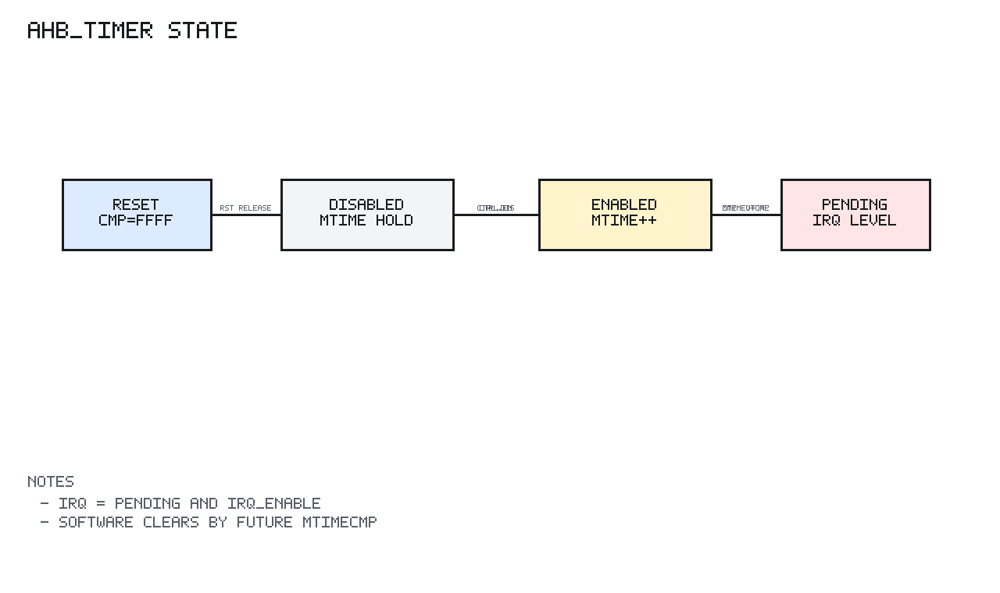

# ahb_timer Design Spec

## 1. Scope

`ahb_timer` is the machine timer peripheral for wasp1.

It exposes a 64-bit `mtime`, a 64-bit `mtimecmp`, control/status registers, and
a timer interrupt output for the core interrupt path.

## 2. Editable Block Diagram

```text
editable source: timer/docs/diagrams/ahb_timer_block.graffle
preview export:  none
detail level:    L1
clock domains:   SEQ clk=hclk_i rst=hresetn_i
```

The diagram separates address decode, request capture, timer counter/compare
state, combinational compare/interrupt generation, read mux, and response
interface. The `mtime` and `mtimecmp` storage is shown as clocked state, while
the pending and read-data paths are shown as combinational logic.

## 3. Register Map

Offsets are relative to `TIMER_BASE`.

| Offset | Register | Access | Description |
| --- | --- | --- | --- |
| `0x00` | `TIMER_CTRL` | R/W | bit0 enable, bit1 irq_enable |
| `0x04` | `TIMER_STATUS` | R | bit0 pending |
| `0x08` | `TIMER_MTIME_LO` | R/W | Low 32 bits of `mtime` |
| `0x0C` | `TIMER_MTIME_HI` | R/W | High 32 bits of `mtime` |
| `0x10` | `TIMER_CMP_LO` | R/W | Low 32 bits of `mtimecmp` |
| `0x14` | `TIMER_CMP_HI` | R/W | High 32 bits of `mtimecmp` |

## 4. Behavior

`mtime` increments by one on each `hclk_i` rising edge when `CTRL.enable` is set.

The pending condition is:

```text
pending = (mtime >= mtimecmp)
```

The interrupt output is:

```text
timer_irq_o = pending && CTRL.irq_enable
```

Pending is level-sensitive. Software clears the pending condition by writing a
future `mtimecmp` value or disabling interrupt output.

`mtimecmp` resets to all ones so reset does not immediately assert pending.

## 5. AHB-Lite Behavior

`ahb_timer` implements a one-cycle response model:

```text
cycle N:
  capture selected NONSEQ/SEQ address/control

cycle N+1:
  return registered read data or write response
```

Only aligned word accesses are supported.

Error response:

```text
out-of-range selected transfer -> ERROR
misaligned selected transfer   -> ERROR
non-word transfer              -> ERROR
unknown register access        -> ERROR
write to read-only STATUS      -> ERROR
```

`HREADY` is always high.

## 6. Sequential State Diagram



PNG generated by `docs/tools/render_state_pngs.py`.

```text
Reset:
  CTRL.enable = 0
  CTRL.irq_enable = 0
  mtime = 0
  mtimecmp = all 1s
  response registers = OKAY/0

Each hclk_i edge:

  AHB capture:
    selected transfer -> capture address/control/error class
    unselected        -> capture idle response

  Counter update:
    if CTRL.enable:
      mtime <- mtime + 1
    else:
      mtime holds

  Register write response:
    legal CTRL write       -> update enable/irq_enable
    legal MTIME_LO/HI write -> update selected 32-bit half of mtime
    legal CMP_LO/HI write   -> update selected 32-bit half of mtimecmp
    STATUS write or illegal write -> no state update except response/error

  Read/response:
    hrdata_o <- selected register read data
    hresp_o  <- OKAY or ERROR from captured transfer

Combinational pending/IRQ:
  pending = mtime >= mtimecmp
  timer_irq_o = pending && CTRL.irq_enable
```

There is no explicit FSM. The timer state is the AHB response capture, control
registers, and 64-bit counter/compare pair.

## 7. Implementation Targets

`ahb_timer` is target-neutral synthesizable logic. It includes
`common/rtl/wasp1_target_defs.svh` and is linted for:

```text
generic simulation
WASP1_TARGET_IC
WASP1_TARGET_FPGA_XILINX_VIRTEX7
```

No FPGA primitive or ASIC macro is required for the first timer implementation.

## 8. Verification Summary

Verified by `tb_ahb_timer`.

Coverage includes:

```text
reset output state
control/status register readback
64-bit mtime and mtimecmp writes
disabled counter stability
enabled counter progress
pending and irq assertion
irq masking
pending clear by future compare value
misaligned, unsupported size, unknown register, and out-of-range errors
deterministic random compare/interrupt tests
generic, IC, and Virtex-7 target lint
```
