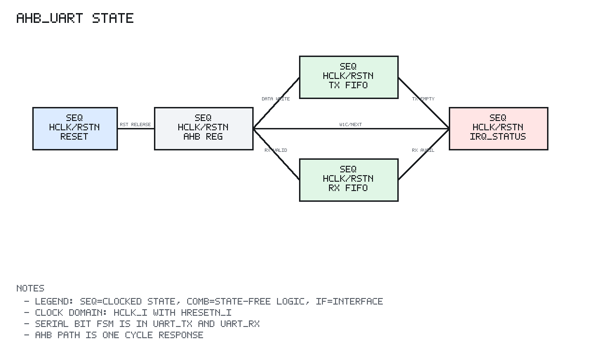

# ahb_uart Design Spec

## 1. Scope

`ahb_uart` is the minimal 8N1 UART peripheral for wasp1.

It provides an AHB-Lite register interface, configurable baud divisor, TX/RX
serial logic, TX/RX FIFOs, RX overrun tracking, and interrupt status.

## 2. Editable Block Diagram

```text
editable source: uart/docs/diagrams/ahb_uart_block.graffle
preview export:  none
detail level:    L2
clock domains:   SEQ clk=hclk_i rst=hresetn_i
```

The diagram separates AHB decode/capture, UART control registers, TX/RX FIFOs,
baud counter state, TX/RX serial state machines, status/IRQ combinational
logic, and the AHB/pin interfaces. All clocked blocks are drawn independently
from the combinational decode and status paths.

## 3. Register Map

Offsets are relative to `UART_BASE`.

| Offset | Register | Access | Description |
| --- | --- | --- | --- |
| `0x00` | `UART_DATA` | R/W | Write pushes TX byte, read pops RX byte |
| `0x04` | `UART_STATUS` | R | TX/RX FIFO and overrun status |
| `0x08` | `UART_CTRL` | R/W | enable, tx_en, rx_en, IRQ enables |
| `0x0C` | `UART_BAUD` | R/W | Baud divisor |
| `0x10` | `UART_IRQ_STATUS` | R/W1C | TX empty, RX available, RX overrun IRQ status |

## 4. Behavior

UART format:

```text
8 data bits
no parity
1 stop bit
LSB first
```

`UART_BAUD` controls the number of `hclk_i` cycles per serial bit. A zero
divisor is treated as one.

Interrupt status bits are latched only when their corresponding interrupt
enable bit is set. `UART_IRQ_STATUS` is cleared by writing ones to the bits to
clear.

RX overrun is set when a received byte arrives while the RX FIFO cannot accept
it. The overrun sticky status clears when software writes one to the overrun IRQ
status bit.

## 5. AHB-Lite Behavior

`ahb_uart` implements a one-cycle response model:

```text
cycle N:
  capture selected NONSEQ/SEQ address/control

cycle N+1:
  return registered read data or write response
```

Only aligned word accesses are supported.

Error response:

```text
out-of-range selected transfer -> ERROR
misaligned selected transfer   -> ERROR
non-word transfer              -> ERROR
unknown register access        -> ERROR
write DATA when TX FIFO full   -> ERROR
write to read-only STATUS      -> ERROR
```

`HREADY` is always high.

## 6. Sequential State Diagram



PNG generated by `docs/tools/render_state_pngs.py`.

```text
Reset:
  CTRL = disabled
  BAUD = reset divisor
  TX/RX FIFO pointers and counts = 0
  IRQ_STATUS = 0
  RX overrun sticky = 0
  AHB response registers = OKAY/0
  uart_tx/uart_rx submodules reset to idle

AHB register response path:
  cycle N:
    selected transfer -> capture address/control/error class
    unselected        -> capture idle response

  cycle N+1:
    legal DATA write and TX FIFO not full -> push hwdata_i[7:0] to TX FIFO
    DATA write when TX FIFO full          -> hresp_o ERROR
    legal DATA read and RX FIFO not empty -> pop RX FIFO and return byte
    CTRL/BAUD/IRQ writes                  -> update selected register
    IRQ_STATUS W1C                        -> clear written sticky IRQ bits
    illegal transfer                      -> hresp_o ERROR

TX datapath:
  TX FIFO not empty && uart_tx ready:
    pop TX FIFO
    launch byte into uart_tx frame state machine

RX datapath:
  uart_rx data_valid pulse && RX FIFO not full:
    push received byte into RX FIFO

  uart_rx data_valid pulse && RX FIFO full:
    RX overrun sticky <- 1

IRQ latch:
  enabled TX empty condition  -> set TX empty IRQ_STATUS
  enabled RX available        -> set RX available IRQ_STATUS
  enabled RX overrun sticky   -> set RX overrun IRQ_STATUS
```

The detailed serial bit-level state is documented in `uart_tx_design_spec.md`,
`uart_rx_design_spec.md`, and `uart_baud_design_spec.md`.

## 7. Implementation Targets

`ahb_uart` is target-neutral synthesizable logic. It includes
`common/rtl/wasp1_target_defs.svh` and is linted for:

```text
generic simulation
WASP1_TARGET_IC
WASP1_TARGET_FPGA_XILINX_VIRTEX7
```

Top-level pad or FPGA IO primitive binding is outside this module.

## 8. Verification Summary

Verified by `tb_ahb_uart`.

Coverage includes:

```text
reset output state
register read/write paths
TX/RX loopback through real serial path
deterministic random loopback bytes
TX FIFO full error
TX empty IRQ
RX available IRQ
RX overrun IRQ and sticky status
W1C IRQ status clear
misaligned, unsupported size, unknown register, and out-of-range errors
generic, IC, and Virtex-7 target lint
```
