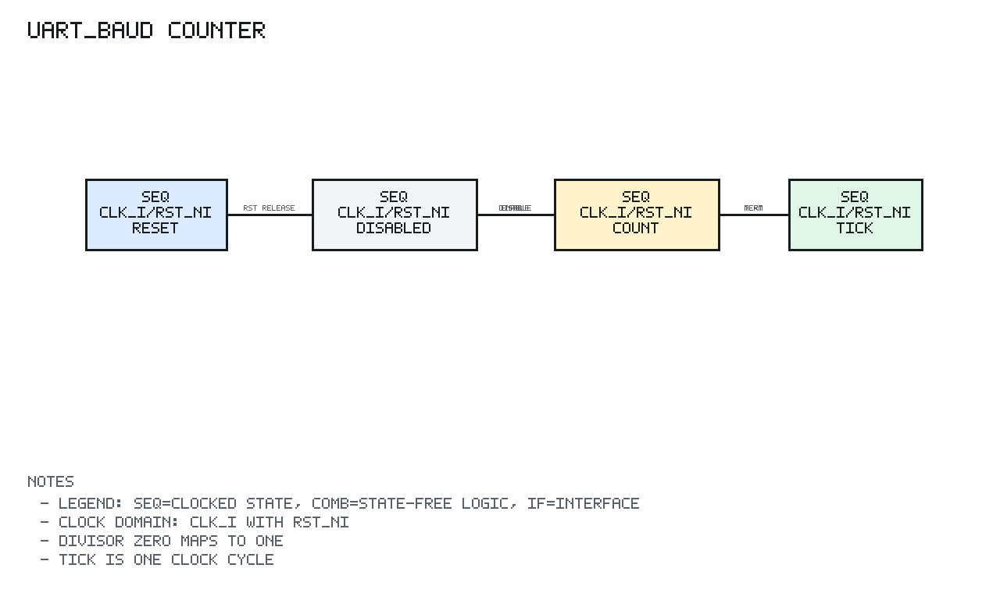

# uart_baud Design Spec

## 1. Scope

`uart_baud` is a small reload-style baud tick generator used by UART TX and RX.

## 2. Block Diagram

```text
Legend: IF=interface, COMB=combinational logic, SEQ=clocked state
SEQ clock/reset domain: clk=clk_i, rst=rst_ni

 clk_i / rst_ni
      |
      v
 +-------------+
 | SEQ count_q |<--- enable_i
 +------+------+     divisor_i
        |
        v
 +-------------+
 | COMB compare|---- tick_o
 | count == N  |
 +-------------+
```

## 3. Design

The counter starts from zero. While enabled, it increments every cycle until it
reaches `terminal_count - 1`. On that cycle, `tick_o` pulses for one cycle and
the counter returns to zero.

`divisor_i == 0` is mapped to one so the generator never creates an invalid
terminal count.

## 4. Reset

Reset clears the counter and deasserts `tick_o`.

## 5. Counter State Diagram



PNG generated by `docs/tools/render_state_pngs.py`.

```text
Reset:
  count_q = 0
  tick_o = 0

Disabled:
  enable_i = 0
    count_q <- 0
    tick_o <- 0

Enabled count:
  enable_i = 1 && count_q < terminal_count - 1
    count_q <- count_q + 1
    tick_o <- 0

Terminal:
  enable_i = 1 && count_q == terminal_count - 1
    count_q <- 0
    tick_o <- 1 for one clk_i cycle
```

`terminal_count` is derived from `divisor_i`, with zero mapped to one.
