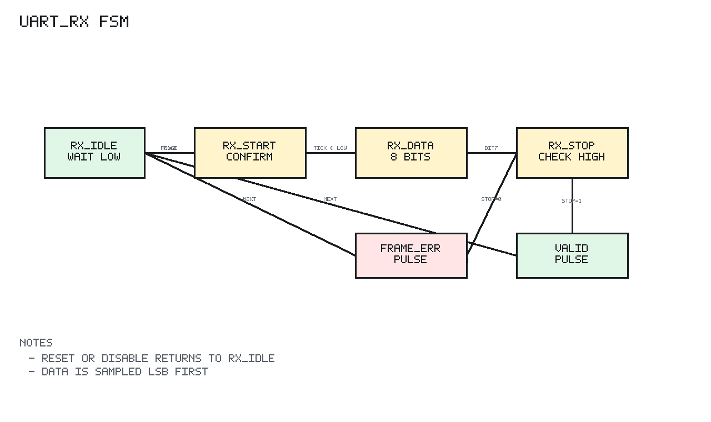

# uart_rx Design Spec

## 1. Scope

`uart_rx` receives one 8N1 UART frame and emits a one-cycle valid pulse with
the received byte.

## 2. Editable Block Diagram

```text
editable source: uart/docs/diagrams/uart_rx_block.graffle
preview export:  none
detail level:    L2
clock domains:   SEQ clk=clk_i rst=rst_ni
```

The diagram separates RX input, receive FSM state, baud tick input, data/bit
index state, sample/control logic, and data-valid/frame-error outputs.

## 3. FSM



PNG generated by `docs/tools/render_state_pngs.py`.

`RX_IDLE` waits for a low start bit.

`RX_START` waits one baud tick and confirms the line is still low before data
sampling begins.

`RX_DATA` samples eight data bits on baud ticks and stores them LSB first.

`RX_STOP` samples the stop bit. A high stop bit produces `data_valid_o`; a low
stop bit produces `frame_error_o`.

Detailed transition diagram:

```text
Reset or enable_i=0:
  -> RX_IDLE

RX_IDLE:
  data_valid_o = 0
  frame_error_o = 0
  uart_rx_i == 1       -> RX_IDLE
  uart_rx_i == 0       -> RX_START

RX_START:
  wait for baud_tick_i
  baud_tick_i && uart_rx_i == 0 -> RX_DATA, bit_idx_q = 0
  baud_tick_i && uart_rx_i == 1 -> RX_IDLE, false start

RX_DATA:
  wait for baud_tick_i
  on tick:
    shift/sample uart_rx_i into data_q[bit_idx_q]
    bit_idx_q < 7 -> RX_DATA, bit_idx_q++
    bit_idx_q = 7 -> RX_STOP

RX_STOP:
  wait for baud_tick_i
  baud_tick_i && uart_rx_i == 1 -> data_valid_o pulse, RX_IDLE
  baud_tick_i && uart_rx_i == 0 -> frame_error_o pulse, RX_IDLE
```

## 4. Reset and Disable

Reset or disable returns the FSM to `RX_IDLE` and clears transient outputs.
