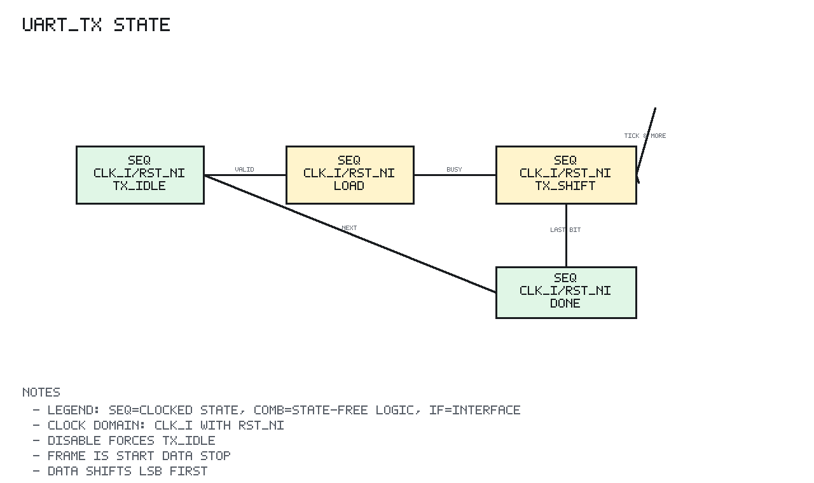

# uart_tx Design Spec

## 1. Scope

`uart_tx` serializes one 8-bit data byte into an 8N1 UART frame.

## 2. Block Diagram

```text
Legend: IF=interface, COMB=combinational logic, SEQ=clocked state
SEQ clock/reset domain: clk=clk_i, rst=rst_ni

 data_valid_i/data_i
        |
        v
 +-------------+
 | COMB frame  |  {stop, data[7:0], start}
 +------+------+
        |
        v
 +-------------+    baud_tick_i
 | SEQ shifter |<----------------+
 +------+------+                 |
        |                        |
        v                        |
      tx_o                +------+------+
                          | SEQ bit_cnt |
                          +-------------+
```

## 3. Design

When enabled and idle, `data_valid_i` loads a 10-bit frame into the shifter:

```text
bit 0      start bit 0
bits 1-8   data bits LSB first
bit 9      stop bit 1
```

On each baud tick while busy, the low shifter bit is driven on `tx_o`, the
shifter shifts right, and the bit counter decrements.

`data_ready_o` is high only when the transmitter is enabled and not busy.

## 4. Reset and Disable

Reset or disable forces TX idle high and clears the busy counter.

## 5. Transmit State Diagram



PNG generated by `docs/tools/render_state_pngs.py`.

`uart_tx` does not use a named FSM enum, but `busy_q` and `bit_count_q` form the
transmit state.

```text
Reset or enable_i=0:
  TX_IDLE
    busy_q = 0
    bit_count_q = 0
    tx_o = 1

TX_IDLE:
  data_ready_o = 1

  data_valid_i && data_ready_o
        |
        v
  TX_SHIFT
    shifter_q <- {stop=1, data_i[7:0], start=0}
    bit_count_q <- 10
    busy_q <- 1

TX_SHIFT:
  data_ready_o = 0
  tx_o = shifter_q[0]

  baud_tick_i && bit_count_q > 1:
    shifter_q <- {1'b1, shifter_q[9:1]}
    bit_count_q <- bit_count_q - 1
    stay TX_SHIFT

  baud_tick_i && bit_count_q == 1:
    busy_q <- 0
    bit_count_q <- 0
    tx_o returns idle high
    next TX_IDLE
```

The disable path has priority over frame shifting and returns immediately to
idle.
